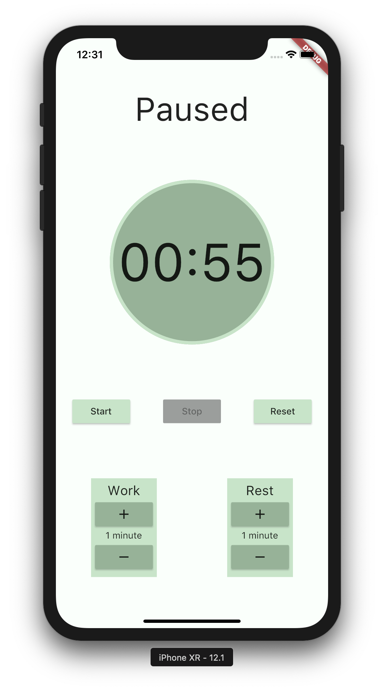
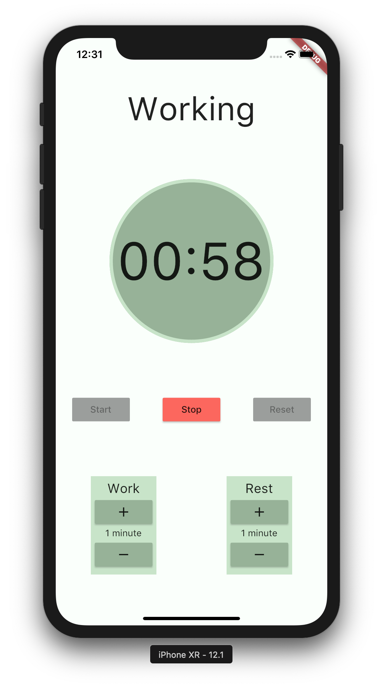
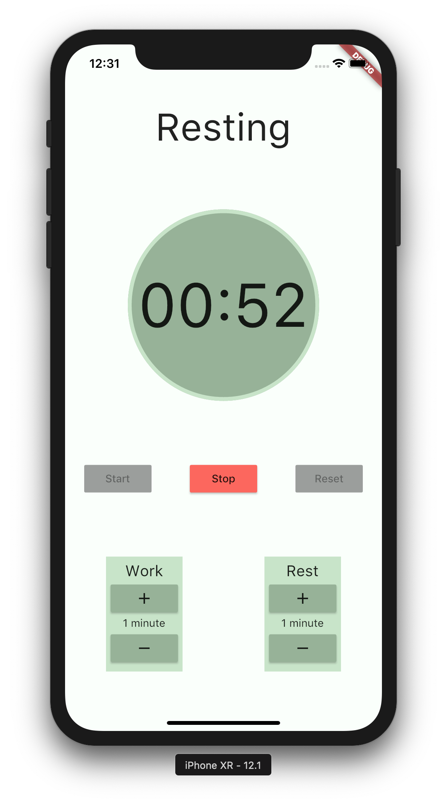

# Orlogio

It's a clock... or a timer... or something?

## What Is This?

This is my first app using the Flutter SDK.

I picked a simple project, a Pomodoro Clock, and went about developing the logic and UI using Flutter.

## How Do I Use It?

For now, the app isn't on the Google Play store or Apple App Store but I hope that it will be soon (as I learn the release processes for both).

Until then, you can download the releases from the "releases" tab on GitHub and sideload the app (I think that would only work for Android) or build and install it yourself using the Flutter CLI.

## Screenshots

